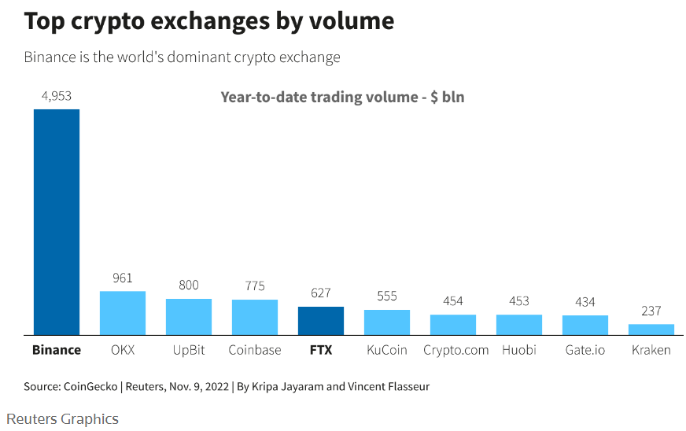

# Atomic Settlement

## Intro

In this short article, we will talk about the business advantages of swapping atomically on-chain.  

## It all started with a big bang
The crypto industry is [largely centralised](https://coinmarketcap.com/rankings/exchanges/) and with the 
failures of [FTX](https://www.nerdwallet.com/article/investing/ftx-crash) and [others](https://www.investopedia.com/terms/m/mt-gox.asp) prior,
there is a lack of trust between participants in the trading ecosystem: customers do not trust 
exchanges, exchanges do not trust exchanges, no one trusts the proof-of-reserves (if at all published),
all are scared of settlement flows because legs cannot be swapped atomically and most exchanges
do require the transfer of assets in some kind of [nostro-vostro account](https://www.investopedia.com/ask/answers/051815/what-difference-between-nostro-and-vostro-account.asp) at the exchange.  

### Crypto Exchanges Trading by Volume

(Nov 2022)

## What is atomic settlement
Atomic Settlement has several properties that would solve settlement in a trustless environment:

- Assets never leave the customers wallets (until settlement time).
- Exchanges are given a trading limit requiring only one control on their side: withdrawal from wallets are contingent to the settlement notional required.
- The atomic settlement requires a smart contract invoked by parties involved in a trade (with optionally the exchange).
- The swap requires two on-chain calls by the customer: an ERC20 approve and the smart contract call with the trade details.
- Assets are swapped atomically on-chain when both trade details match: both legs succeed or fail at the same time!
- Non-native assets (i.e. non ERC20s like DAI or USDC/T) can have a synthetic representation (IOU) with a qualified custodian holding the assets.

### Role of a custodian
A qualified custodian plays the following role:
- Hold assets for customers and provide the capability to invoke smart contracts on EVM-based chains.
- Co-develop and own the Settlement Smart Contracts (can have multiple SCs on various chains).

### Role of an exchange
Integrate with a custodian API to:
- Control withdrawals based on current settlement requirements
- Optionally integrate with the smart contract (if tri-party checks are required)

### Costs & revenue
- There is a one-off gas fee cost to invoke the ERC20 approve operation
- Each trade detail invocation (gas fee + payable)
- The payable amount would be held in the smart contract and share among participants
